# 合同智能生成系统 · SSE 实时流式事件架构

## 系统架构

```
┌──────────────────────────────────────────────────────────────────┐
│                        前端 (test_frontend.html)                  │
│   EventSource ← SSE ← 3列布局(控制/实时输出/事件流) + 输入框     │
└──────────────────────┬───────────────────────────────────────────┘
                       │ HTTP POST / GET
                       │ SSE text/event-stream
                       ▼
┌──────────────────────────────────────────────────────────────────┐
│                    SSE Server (FastAPI + Uvicorn)                 │
│                                                                   │
│  ┌──────────┐  ┌─────────────────┐  ┌──────────────────────────┐ │
│  │ main.py  │  │ session_manager │  │    orchestrator.py       │ │
│  │ SSE端点  │──│ .py             │──│ 8步工作流编排            │ │
│  │ REST API │  │ Session生命周期  │  │ Agent调度/取消/超时      │ │
│  └──────────┘  └─────────────────┘  └──────────┬───────────────┘ │
└────────────────────────────────────────────────┬──────────────────┘
                                                 │ EventBus
                                                 ▼
┌──────────────────────────────────────────────────────────────────┐
│                     Agent 层 (thread pool)                        │
│                                                                   │
│  ┌───────────────┐ ┌──────────────┐ ┌─────────────────────────┐  │
│  │ UserField     │ │ Outline      │ │ OutlineModification     │  │
│  │ Extraction    │ │ Generation   │ │ Agent (interactive)     │  │
│  │ Agent(交互)   │ │ Agent        │ └─────────────────────────┘  │
│  └───────────────┘ └──────────────┘ ┌─────────────────────────┐  │
│  ┌───────────────┐ ┌──────────────┐ │ ContractModification    │  │
│  │ DrafterAgent  │ │ ReviewAgents │ │ Agent (interactive)     │  │
│  │ (并行4个)     │ │ (并行4个)     │ └─────────────────────────┘  │
│  └───────────────┘ └──────────────┘ ┌─────────────────────────┐  │
│  ┌───────────────┐ ┌──────────────┐ │ AdversarialOutline      │  │
│  │ LeaderAgent   │ │ OutlineGen   │ │ Agent (对抗式大纲)      │  │
│  │               │ │ WOTem        │ └─────────────────────────┘  │
│  └───────────────┘ └──────────────┘                              │
└──────────────────────────────────────────────────────────────────┘
```

---

## 后端架构

### 1. SSE Server (`sse_server/main.py`)

FastAPI 应用，监听 `0.0.0.0:8000`，提供以下端点：

| 端点 | 方法 | 说明 |
|------|------|------|
| `/api/contract/generate/sse?session_id=xxx` | GET | SSE 长连接，流式推送 Agent 事件 |
| `/api/contract/start` | POST | 启动合同生成流程 |
| `/api/contract/user-input` | POST | 向交互式 Agent 发送用户输入 |
| `/api/contract/status/{session_id}` | GET | 查询 Session 状态 |
| `/api/contract/sessions` | GET | 列出所有活跃 Session |
| `/api/contract/session/{session_id}` | DELETE | 销毁 Session |

**SSE 协议格式：**
- 不使用 `event:` 字段（浏览器 EventSource 命名事件有兼容问题）
- 所有事件类型通过 `data` 中的 `event_type` 字段传递
- 前端统一通过 `onmessage` 接收
- 每 30 秒心跳 `session.ping`（断线自动重连）

**断线重连：** 使用 `EventRingBuffer` 缓存最近 200 条事件（由于每个toen都会发宋事件，其实200远远不够）。重连时前端发送 `Last-Event-ID`，服务端回放后续事件。

### 2. Session 管理器 (`sse_server/session_manager.py`)

管理 Session 的完整生命周期：

- **SessionState**：每个 Session 包含 EventBus 实例、Session 状态、当前步骤/Agent、工作流 Task
- **SessionManager**：单例，自动清理过期 Session（60 秒间隔）
- **销毁流程**：
  1. `state.cancel()` → 标记取消 + 解阻塞 `wait_for_user_input`
  2. `state.workflow_task.cancel()` → 取消 asyncio Task
  3. `state.event_bus.close()` → 关闭事件队列
  4. 下游检测 `_closed` / `_cancelled` 后自动退出

### 3. EventBus (`agent/utils/event_bus.py`)

异步事件总线，每个 Session 一个实例：

**核心组件：**
| 组件 | 说明 |
|------|------|
| `asyncio.Queue` | 异步队列，SSE 端点消费 |
| `EventRingBuffer` | 环形缓冲区（200 条），断线重连回放 |
| `asyncio.Event` | 异步 `wait_for_user_input`（async 上下文） |
| `threading.Event` | 同步 `wait_for_user_input_sync`（线程上下文） |

**事件体系：**

| 事件类型 | 说明 | 数据字段 |
|---------|------|---------|
| `workflow.start / complete` | 工作流生命周期 | `steps_total`, `total_duration` |
| `step.start / complete / error` | 步骤生命周期 | `step_name`, `duration` |
| `agent.start / end` | Agent 实例生命周期 | `input_summary`, `duration` |
| `agent.think` | ReAct 思考过程 | `content` |
| `agent.act` | ReAct 执行动作 | `act_type`, `params`, `completed` |
| `agent.ask` | Agent 提问，等待用户输入 | `question`, `expects_input` |
| `agent.think.stream` | 思考字段流式 Token(`STREAM_EVENT_MAP`) | `text` |
| `agent.answer.stream` | 回答字段流式 Token(`STREAM_EVENT_MAP`) | `text` |
| `agent.act.stream` | 动作字段流式 Token(`STREAM_EVENT_MAP`) | `text` |
| `llm.start / token / done / error` | LLM 调用全过程 | `model`, `text`, `usage`(含token数) |
| `tool.call / result` | 工具调用 | `tool_name`, `params`, `success` |
| `user.input` | 用户输入事件 | `text` |
| `system` | 系统消息 | `message` |
| `session.*` | Session 生命周期 | 见具体事件 |
| `parallel.*` | 并行执行事件 | `group`, `agents_count` |

**线程安全：** `put_sync()` 使用 `asyncio.run_coroutine_threadsafe` 从工作线程投递事件到主事件循环。

### 4. 异步 LLM 调用 (`agent/llm/async_llm.py`)

基于 `openai.AsyncClient` + `stream=True` 的异步流式调用：

```
async_llm_call()
  ├─ emit_llm_start(model)         ← LLM 调用开始
  ├─ emit_llm_token(text) × N      ← 每个 token 实时推送
  ├─ emit_llm_done(full, usage)    ← 完成 + token 统计
  └─ return full_text

sync_llm_call_with_events()        ← 同步包装器
  └─ 创建独立事件循环
     └─ loop.run_until_complete(async_llm_call())
```

**技术要点：**
- `stream_options={"include_usage": True}` — 获取精确 token 用量
- 自动重试 + 指数退避 + 模型降级
- 每次 token 后检查 `eb._closed`，支持实时取消
- `KeyPathTracker` 逐字符追踪 JSON key path，按 `STREAM_EVENT_MAP` 发射字段级流式事件

### 5. 流式 JSON KeyPath 追踪器 (`agent/utils/stream_parser.py`)

**KeyPathTracker** — 纯语法 JSON 流式解析器，不依赖 schema 信息：

```
输入: 流式 token "{\"think\":\"分析\",\"act\":\"use_tool\"}"
输出: (("think",), "分"), (("think",), "析"), (("act",), "u"), ...

Agent 声明 STREAM_EVENT_MAP:
  {("think",): "agent.think.stream",
   ("act",): "agent.act.stream"}

  → 输出: emit("agent.think.stream", "分")
         emit("agent.think.stream", "析")
         emit("agent.act.stream", "u")
```

### 6. AgentConfig 类级 Patch (`agent/core/base_agent.py`)

`patch_llm_call_for_events()` 在 **两个层面** 注入流式能力：

1. **AgentConfig 类级别**（`AgentConfig.llm_call`）— 跨线程生效
   - 任何 `cfg.llm_call()` (包括不同 config 文件的调用) 都自动走流式
   - 每个 config 文件的 `model_id` / `temperature` 自动生效
2. **self.llm_call 实例级别** — 给直接调用的 Agent 用

**运行机制：**
```
patch_llm_call_for_events()
  ├─ AgentConfig._streaming_ctx = {eb, agent_name, step, stream_event_map}
  ├─ AgentConfig.llm_call = _patched → 检查 _streaming_ctx → 走流式
  └─ self.llm_call = _streaming_wrapper → 直接调用 sync_llm_call_with_events
```

### 7. 工作流编排 (`sse_server/orchestrator.py`)

8 步流程编排，每步通过 `async asyncio.get_event_loop().run_in_executor(None, func)` 在线程池中运行 Agent：

| 步骤 | 名称 | Agent | 说明 |
|------|------|-------|------|
| 1 | 用户需求提取 | `UserFieldExtractionAgent` | 交互式对话，提取字段 |
| 2 | 合同模板匹配 | `deal_chunk.py` | 相似度匹配 |
| 3 | 初始合同大纲生成 | `OutlineGenerationAgent` / `AdversarialOutlineAgent` | 有模板/零模板 |
| 4 | 大纲修改 | `OutlineModificationAgent` | 交互式，用户可反馈 |
| 5 | 合同内容补全 | `DrafterAgent`(×4 并行) | 4 chunk 并行补全 |
| 6 | 合同审查 | `ReviewAgents`(×4 并行) | 完整性/一致性/合法性/需求 |
| 7 | 智能修订 | `LeaderAgent` | 汇总审查结果执行修改 |
| 8 | 最终确认 | `ContractModificationAgent` | 交互式确认 |

**交互步骤（1/4/8）：** 通过 `Agent.emit_agent_ask()` → 前端展示 → 用户输入 → `POST /user-input` → `EventBus.set_user_input()` → 解阻塞 Agent → 继续

**取消机制：**
- `SessionState.cancel()` → `EventBus.set_user_input("")` + `EventBus.close()`
- 流式循环中逐 token 检查 `eb._closed`
- Agent 循环入口检查 `state._cancelled`
- 重试边界检查 `eb._closed`
- 超时容忍（`_timeout_seconds` 定时器）

---

## 前端架构 (`test_frontend.html`)

### 实现内容
目前前端仅是测试所有事件的触发以及流式输出，后续希望前端能够实时展示大纲/合同的变化情况，并且需要增量显示（diff）每次修改的部分（红绿色快）。
### 页面布局（3 列 · 可拖动）

```
┌──────────────┬───────────────┬──────────────────────────────┐
│   左侧面板    │  可拖动       │  中间面板                    │  可拖动  │   右侧面板             │
│   260px(可调) │  ┃           │  320px(可调)                │  ┃      │   flex(可调)           │
│              │  ┃           │                             │  ┃      │                        │
│ 会话控制      │  ┃           │  ┌ 实时输出(Timeline) ──┐   │  ┃      │  📋 事件流              │
│ 会话状态      │  ┃           │  │ 第 1 轮 ▶ 摘要        │   │  ┃      │  按时间顺序结构化展示   │
│ 事件统计      │  ┃           │  │ 第 2 轮 ▼             │   │  ┃      │                        │
│ 连接方式      │  ┃           │  │  💭 思考...            │   │  ┃      │  ┌─输入框────────┐    │
│              │  ┃           │  │  ⚡ answer_user         │   │  ┃      │  │ ✎ 用户输入...   │    │
│              │  ┃           │  │  🤖 回答...             │   │  ┃      │  └────────────────┘    │
│              │  ┃           │  └────────────────────────┘   │  ┃      │                        │
└──────────────┴───────────────┴──────────────────────────────┴─────────┴────────────────────────┘
```

### 前端技术要点

| 功能 | 实现 |
|------|------|
| SSE 连接 | 原生 `EventSource`，`onmessage` 统一接收 |
| 断线重连 | 原生 EventSource 自动重连 |
| 3 列网格 | CSS flexbox，`flex-shrink: 0` + `flex: 1` |
| 列宽拖动 | 原生 `mousedown`/`mousemove`/`mouseup` 事件 |
| Token 流式渲染 | 累计 token 到 `textContent`（不破坏 DOM） |

### 事件渲染规则

| 事件类型 | CSS 类 | 展示位置 |
|---------|--------|---------|
| `workflow.start/complete` | `event-workflow` | 事件流 |
| `step.start/complete/error` | `event-step` | 事件流 + 会话状态 |
| `agent.start/end` | `event-step` | 事件流 |
| `agent.think` | `event-agent-think` | 事件流 |
| `agent.act` | `event-agent-act` | 事件流 |
| `agent.ask` | `event-agent-ask` | 事件流 + 激活输入框 |
| **`agent.think.stream`** | — | **中间 Timeline 卡片** |
| **`agent.answer.stream`** | — | **中间 Timeline 卡片** |
| **`agent.act.stream`** | — | **中间 Timeline 卡片** |
| `user.input` | `event-user-input` | 事件流 |
| `llm.start/done` | `event-llm-start/done` | 事件流 |
| `tool.call/result` | `event-tool` | 事件流 |
| `system` | `event-system` | 事件流 |
| `error` | `event-error` | 事件流 + 状态标记 |

### Timeline 面板

每轮 LLM 调用一张卡片，按时间顺序竖直排列：

```
┌ 第 1 轮 ▶ [摘要]          ← 折叠状态
└─────────────────────────────┘

┌ 第 2 轮 ▼ ───────────────┐  ← 展开状态
│ 💭 思考                    │
│ 分析用户意图...             │  ← 逐字流式累积
│                            │
│ ⚡ 动作                    │
│ answer_user                │  ← 逐字流式累积
│                            │
│ 🤖 回答                    │
│ 好的，已为您修改...         │  ← 逐字流式累积
└─────────────────────────────┘
```

- 折叠状态：显示轮次编号 + 回答摘要（前 60 字）
- 点击标题展开/折叠
- **LLM 调用开始时自动展开**，**完成后自动折叠并显示摘要**

---

## Agent 流式适配状态

### STREAM_EVENT_MAP

每个 Agent 通过类属性 `STREAM_EVENT_MAP` 声明 JSON 字段到事件类型的映射：

| Agent | 思考字段 | 回答字段 | 动作字段 |
|-------|---------|---------|---------|
| `OutlineModificationAgent` | `think` | `parameter.answer_text`, `parameter.question` | `act` |
| `ContractModificationAgent` | `think` | `parameter.answer_text`, `parameter.question` | `act` |
| `DrafterAgent` | `think` | `parameter.answer_text` | `act` |
| `UserFieldExtractionAgent` | — | `response` | — |
| `OutlineGenerationAgent` | `思考` | — | — |
| `OutlineGenerationWOTem` (AdversarialOutlineAgent) | `think` | `parameter.answer_text` | `act` |
| `LeaderAgent` | `strategy_summary` | — | `decisions` |
| `ReviewAgents` | 无交互字段，不设 map | | |

### 流式覆盖说明

1. **`llm.token`** — 原始 JSON 片段（前端静默丢弃，已通过 `agent.*.stream` 展示）
2. **`agent.think.stream`** / **`agent.answer.stream`** / **`agent.act.stream`** — KeyPathTracker 实时逐字推送
3. **`agent.ask`** — Agent 手动推送（LLM 完成后触发，前端用完整文本替换流式内容，激活输入框）

---

## 配置说明

### `configs/*.json` 配置文件

```json
{
    "api_key_name": "baiLianKey",
    "base_url": "https://dashscope.aliyuncs.com/compatible-mode/v1",
    "model_id": "deepseek-v3.2",
    "fallback_model_id": "deepseek-v4-flash",
    "temperature": 0.7,
    "timeout": 200,
    "max_retries": 2,
    "base_delay": 1,
    "max_loop": 30,
    "inner_max_loop": 5
}
```

| 文件 | 用途 | 默认温度 |
|------|------|---------|
| `config_user_need_extraction.json` | 用户需求提取 | 0.4 |
| `config_outline_generation.json` | 大纲生成(有模板) | 0.4 |
| `config_outline_adversarial.json` | 抗生成(主配置) | 0.8 |
| `config_outline_adversarial_initial.json` | 抗初始生成 | 0.3 |
| `config_outline_adversarial_react.json` | 抗 ReAct 修复 | 0.3 |
| `config_outline_modification.json` | 大纲修改 | 0.7 |
| `config_initial_contract.json` | 合同补全 | 0.4 |
| `config_review.json` | 审查 | 0.4 |
| `config_leader.json` | 智能修订 | 0.4 |
| `config_contract_modification.json` | 合同修改 | 0.7 |

### 模型策略

| Agent | 模型 | 温度 | 说明 |
|-------|------|------|------|
| ModelA (初始生成、修复) | deepseek-v3.2 | 0.3 | 精确，低随机性 |
| 交互修改 Agent | deepseek-v3.2 | 0.7 | 灵活回答用户 |
| ModelB (审查) | deepseek-v4-flash | 0.8 | 快速审查，高随机性发现漏洞 |
| 其余 Agent | deepseek-v3.2 | 0.4 | 平衡精确和灵活性 |
| 降级备用 | deepseek-v4-flash | — | 超时/失败时自动降级 |

---

## 快速启动

### 后端

```bash
cd Agent_generation
python main.py server
# Uvicorn running on http://0.0.0.0:8000
```

### 前端

直接在浏览器打开 `test_frontend.html`，点击「新建会话」即可。

---

## 事件流时序图（典型合同生成）

```mermaid
sequenceDiagram
    actor 用户
    participant 前端 as 前端 (EventSource)
    participant API as SSE Server (FastAPI)
    participant EB as EventBus
    participant Agent as Agent 层 (线程池)

    用户->>前端: 点击"新建会话"
    前端->>API: POST /api/contract/start
    API->>EB: emit workflow.start
    EB-->>前端: SSE: workflow.start
    前端->>前端: 创建 EventSource 连接

    rect rgb(30,40,60)
        Note over 用户,Agent: Step 1: 用户需求提取（交互式）
        API->>Agent: run_in_executor(UserFieldExtractionAgent)
        Agent->>EB: emit agent.ask("请问需要什么合同？")
        EB-->>前端: SSE: agent.ask
        前端->>前端: 激活输入框
        用户->>前端: 输入需求
        前端->>API: POST /api/contract/user-input
        API->>EB: emit user.input
        API->>Agent: EventBus.set_user_input(text)
        Agent->>EB: emit llm.start → llm.token × N → llm.done
        Agent->>EB: emit agent.answer.stream × N (逐字流式)
        EB-->>前端: SSE (实时推送)
        Agent->>EB: emit agent.ask("已提取到...")
        EB-->>前端: SSE: agent.ask
        用户->>前端: 继续对话...
        前端-->>API: (循环)
    end

    rect rgb(40,50,30)
        Note over 用户,Agent: Step 3: 合同大纲生成
        API->>Agent: run_in_executor(OutlineGenerationAgent)
        Agent->>EB: emit llm.start
        Agent->>EB: emit agent.think.stream × N (思考过程)
        EB-->>前端: SSE (timeline 面板实时累积)
        Agent->>EB: emit llm.done
    end

    rect rgb(30,40,60)
        Note over 用户,Agent: Step 4: 大纲修改（交互式）
        Agent->>EB: emit agent.ask
        EB-->>前端: SSE: agent.ask
        用户->>前端: 输入修改意见
        前端-->>API: POST /api/contract/user-input
        API-->>Agent: 解阻塞
        Agent->>EB: emit llm.start → agent.answer.stream → llm.done
        EB-->>前端: SSE (timeline + 事件流)
        Agent->>EB: emit agent.ask("已修改，请确认")
        EB-->>前端: SSE: agent.ask
    end

    rect rgb(40,50,30)
        Note over 用户,Agent: Step 5-7: 起草 + 审查 + 修订（无交互）
        API->>Agent: run_in_executor(DrafterAgent ×4 并行)
        API->>Agent: run_in_executor(ReviewAgents ×4 并行)
        API->>Agent: run_in_executor(LeaderAgent)
        Agent->>EB: emit step.complete × N
        EB-->>前端: SSE: 步骤进度
    end

    rect rgb(30,40,60)
        Note over 用户,Agent: Step 8: 最终确认
        Agent->>EB: emit agent.ask("合同已生成，请确认")
        EB-->>前端: SSE: agent.ask
        用户->>前端: 确认/修改
        前端-->>API: POST /api/contract/user-input
        API-->>Agent: 解阻塞
        Agent->>EB: emit workflow.complete
        EB-->>前端: SSE: workflow.complete
    end
```


